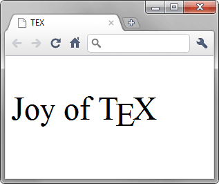

# htmlbook_pract
Мои решения задач с сайта http://htmlbook.ru/practical
Задачи распределены по каталогам low, medium, high по уровню сложности задач.
Стиль для каждой задачи выбран inline или embedded, чтобы не множить файлы css.
Картинки для каждого уровня сложности в соответствующем каталоге img.

<!-- # Содержание -->
# Contents
- [htmlbook_pract](#htmlbook_pract)
- [Contents](#contents)
- [Задачи легкого уровня сложности](#задачи-легкого-уровня-сложности)
  - [TEX](#tex)
  - [Андроид в тени](#андроид-в-тени)
  - [Асуанская плотина](#асуанская-плотина)
  - [Верхний и нижний индекс](#верхний-и-нижний-индекс)
  - [Вложенные списки](#вложенные-списки)
  - [Выворотка](#выворотка)
  - [Заголовки](#заголовки)
  - [Из XHTML в HTML5](#из-xhtml-в-html5)
  - [Из XHTML в HTML5](#из-xhtml-в-html5-1)
  - [Использование спецсимволов](#использование-спецсимволов)
  - [Исправление ошибок 1](#исправление-ошибок-1)
  - [Исправление ошибок 2](#исправление-ошибок-2)
  - [Исправление ошибок 3](#исправление-ошибок-3)
  - [Исправление ошибок 4](#исправление-ошибок-4)
  - [Исправление ошибок 5](#исправление-ошибок-5)
  - [Карты](#карты)
  - [Многочлен степени n](#многочлен-степени-n)
  - [Нумерованный и маркированный список](#нумерованный-и-маркированный-список)
  - [Объединение ячеек таблицы](#объединение-ячеек-таблицы)
# Задачи легкого уровня сложности 
## TEX
Условие задачи: [TEX](http://htmlbook.ru/practical/tex)

[Посмотреть в браузере](https://raw.githack.com/lightforce2017/htmlbook_pract/master/1_low/TEX.html)

Текст условия:

Оформите текст, как показано на рис. 1.

Рис. 1

## Андроид в тени
Условие задачи: [Андроид в тени](http://htmlbook.ru/practical/android-v-teni)

[Посмотреть в браузере](https://raw.githack.com/lightforce2017/htmlbook_pract/master/1_low/TEX.html)

## Асуанская плотина
Условие задачи: [Асуанская плотина](http://htmlbook.ru/practical/asuanskaya-plotina)

[Посмотреть в браузере](https://raw.githack.com/lightforce2017/htmlbook_pract/master/1_low/TEX.html)

## Верхний и нижний индекс
Условие задачи: [Верхний и нижний индекс](http://htmlbook.ru/practical/verkhniy-i-nizhniy-indeks)

[Посмотреть в браузере](https://raw.githack.com/lightforce2017/htmlbook_pract/master/1_low/TEX.html)

## Вложенные списки
Условие задачи: [Вложенные списки](http://htmlbook.ru/practical/vlozhennye-spiski)

[Посмотреть в браузере](https://raw.githack.com/lightforce2017/htmlbook_pract/master/1_low/TEX.html)

## Выворотка
Условие задачи: [Выворотка](http://htmlbook.ru/practical/vyvorotka)

[Посмотреть в браузере](https://raw.githack.com/lightforce2017/htmlbook_pract/master/1_low/TEX.html)

## Заголовки
Условие задачи: [Заголовки](http://htmlbook.ru/practical/zagolovki)

[Посмотреть в браузере](https://raw.githack.com/lightforce2017/htmlbook_pract/master/1_low/TEX.html)

## Из XHTML в HTML5
Условие задачи: [Из XHTML в HTML5](http://htmlbook.ru/practical/iz-xhtml-v-html5)

[Посмотреть в браузере](https://raw.githack.com/lightforce2017/htmlbook_pract/master/1_low/TEX.html)

## Из XHTML в HTML5
Условие задачи: [Из XHTML в HTML5](http://htmlbook.ru/practical/iz-xhtml-v-html5-0)

[Посмотреть в браузере](https://raw.githack.com/lightforce2017/htmlbook_pract/master/1_low/TEX.html)

## Использование спецсимволов
Условие задачи: [Использование спецсимволов](http://htmlbook.ru/practical/ispolzovanie-spetssimvolov)

[Посмотреть в браузере](https://raw.githack.com/lightforce2017/htmlbook_pract/master/1_low/TEX.html)

## Исправление ошибок 1
Условие задачи: [Исправление ошибок](http://htmlbook.ru/practical/ispravlenie-oshibok-1)

[Посмотреть в браузере](https://raw.githack.com/lightforce2017/htmlbook_pract/master/1_low/TEX.html)

## Исправление ошибок 2
Условие задачи: [Исправление ошибок](http://htmlbook.ru/practical/ispravlenie-oshibok)

[Посмотреть в браузере](https://raw.githack.com/lightforce2017/htmlbook_pract/master/1_low/TEX.html)

## Исправление ошибок 3
Условие задачи: [Исправление ошибок](http://htmlbook.ru/practical/ispravlenie-oshibok-3)

[Посмотреть в браузере](https://raw.githack.com/lightforce2017/htmlbook_pract/master/1_low/TEX.html)

## Исправление ошибок 4
Условие задачи: [Исправление ошибок](http://htmlbook.ru/practical/ispravlenie-oshibok-0)

[Посмотреть в браузере](https://raw.githack.com/lightforce2017/htmlbook_pract/master/1_low/TEX.html)

## Исправление ошибок 5
Условие задачи: [Исправление ошибок](http://htmlbook.ru/practical/ispravlenie-oshibok-2)

[Посмотреть в браузере](https://raw.githack.com/lightforce2017/htmlbook_pract/master/1_low/TEX.html)

## Карты
Условие задачи: [Карты](http://htmlbook.ru/practical/karty)

[Посмотреть в браузере](https://raw.githack.com/lightforce2017/htmlbook_pract/master/1_low/TEX.html)

## Многочлен степени n
Условие задачи: [Многочлен степени n](http://htmlbook.ru/practical/mnogochlen-stepeni-n)

[Посмотреть в браузере](https://raw.githack.com/lightforce2017/htmlbook_pract/master/1_low/TEX.html)

## Нумерованный и маркированный список
Условие задачи: [Нумерованный и маркированный список](http://htmlbook.ru/practical/numerovannyy-i-markirovannyy-spisok)

[Посмотреть в браузере](https://raw.githack.com/lightforce2017/htmlbook_pract/master/1_low/TEX.html)

## Объединение ячеек таблицы
Условие задачи: [Объединение ячеек таблицы](http://htmlbook.ru/practical/obedinenie-yacheek-tablitsy)

[Посмотреть в браузере](https://raw.githack.com/lightforce2017/htmlbook_pract/master/1_low/TEX.html)

#